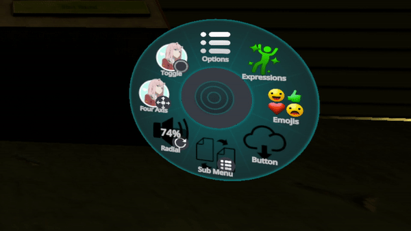

[![MIT License][license-shield]][license-url]
<!--
![Downloads][downloads-shield] -->


<br />
<p align="center">

  <h3 align="center">ActionMenuApi</h3>

  <p align="center">
    Currently in the process the rewriting old script used in my other mod "ActionMenuUtils"
    <br />
    <a href="https://github.com/gompocp/ActionMenuApi/issues">Request Feature</a>
  </p>
</p>


<!-- TABLE OF CONTENTS -->
<details open="open">
  <summary><h2 style="display: inline-block">Table of Contents</h2></summary>
  <ol>
    <li>
      <a href="#info">Info</a>
    </li>
    <li>
      <a href="#getting-started">Getting Started</a>
      <ul>
        <li><a href="#building">Building</a></li>
      </ul>
    </li>
    <li><a href="#usage">Usage</a></li>
    <li><a href="#license">License</a></li>
    <li><a href="#acknowledgements">Acknowledgements</a></li>
  </ol>
</details>


## Info
<a href="https://github.com/gompocp/ActionMenuApi">
    
</a> 

Supports the usage
- Radial puppet
- Four Axis puppet 
- Button
- Toggle 
- SubMenu  

## Getting Started

To use simply add ActionMenuApi to your mods folder and reference it in your project same way as with UIX

### Building 

1. Clone the repo
   ```sh
   git clone https://github.com/gompocp/ActionMenuApi.git
   ```
2. Fix references (all available in VRChat\MelonLoader\Managed)
3. Make sure to edit the post build event in the TestMod's `.csproj` and set the copy path to your own mods folder before clicking build solution


## Usage

```cs
using ActionMenuApi;
/*

Code

*/

//To add a button to the main page of the action menu
AMAPI.AddButtonPedalToMenu(ActionMenuPageType.Main, () => MelonLogger.Msg("Pressed Button") , "Button", buttonIcon);

//To add a toggle to the main page of the action menu
AMAPI.AddTogglePedalToMenu(ActionMenuPageType.Main, testBool, b => testBool = b, "Toggle", toggleIcon);

//To add a radial pedal to the main page of the action menu
AMAPI.AddRadialPedalToMenu(ActionMenuPageType.Main, f => testFloatValue = f, "Radial", testFloatValue, radialIcon);

//To add a submenu to the main page of the action menu and add a toggle and button to it
AMAPI.AddSubMenuToMenu(ActionMenuPageType.Main, 
    delegate {
        MelonLogger.Msg("Sub Menu Opened");
        AMAPI.AddButtonPedalToSubMenu(() => MelonLogger.Msg("Pressed Button In Sub Menu"), "Sub Menu Button", buttonIcon);
        AMAPI.AddTogglePedalToSubMenu(b => testBool2 = b, testBool2, "Sub Menu Toggle", toggleIcon);
    },
    "Sub Menu", 
    subMenuIcon
);
```

_For a mod example check out the test mod [here](https://github.com/gompocp/ActionMenuApi/tree/main/ActionMenuTestMod)_


## License

Distributed under the GPL-3.0 License. See `LICENSE` for more information.


Project Link: [https://github.com/gompocp/ActionMenuApi](https://github.com/gompocp/ActionMenuApi)


## Acknowledgements

* XRef method from [BenjaminZehowlt](https://github.com/BenjaminZehowlt/DynamicBonesSafety/blob/master/DynamicBonesSafetyMod.cs)
* [Knah](https://github.com/knah/VRCMods/) assetbundle loading example


[license-shield]: https://img.shields.io/github/license/gompocp/ActionMenuApi.svg?style=for-the-badge
[license-url]: https://github.com/gompocp/ActionMenuApi/blob/main/LICENSE
[downloads-shield]: https://img.shields.io/github/downloads/gompocp/ActionMenuApi/total?style=for-the-badge
